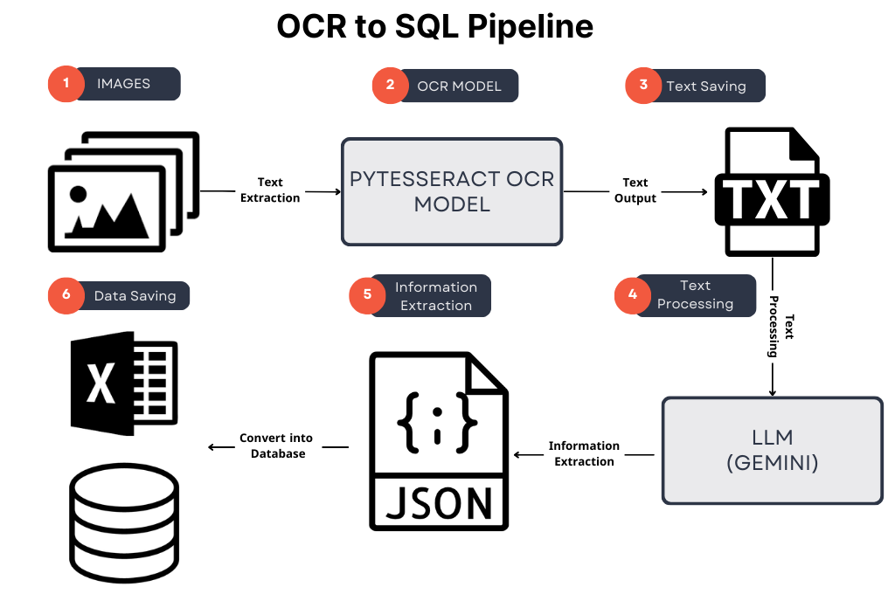

# OCR to SQL Pipeline

This project automates the process of extracting text from images using Optical Character Recognition (OCR), refining the extracted text with a Language Learning Model (LLM), and saving the data into structured formats like JSON, Excel, and an SQL database.

### Features

- Text Extraction from Images: Utilizes the Pytesseract OCR model to extract text from a batch of images.
- Text Refinement: Refines and processes the extracted text using the Gemini LLM to ensure accuracy and correct any errors.
- Data Structuring: Saves processed data into structured formats like JSON and Excel.
- SQL Conversion: Converts the structured data into an SQL database for further use and queries.
- Retry Mechanism: Implements retry logic with exponential backoff for rate limits or resource exhaustion issues.
  
### Pipeline Overview

### Project Structure

- Image Processing: Extracts text from images using Pytesseract OCR.
- Text Saving: Saves the extracted text into a text file for further processing.
- Text Refinement: Processes the saved text using LLM (Gemini) to refine and structure the data.
- Information Extraction: Extracts key information from the text (such as Name, Exam Scores, Date, etc.).
- Data Saving: The structured data is saved into JSON and Excel formats.
- SQL Conversion: Finally, the Excel data is converted into a fully structured SQL database.

### Results

Extracted Text from Images:

SQL Database Output:

### Demo Video

https://drive.google.com/drive/folders/10a72gE6xU-Zc6Fh7G4zUKR94F1hE5K_C?usp=sharing

### Prerequisites

- Python 3.x
- Git
- Pytesseract
- Langchain
- Gemini LLM
- SQLite (for SQL conversion)
- Libraries: pandas, tqdm, json, google.api_core, sqlite3

### Contributing

Feel free to submit pull requests or report issues. Any contributions are welcome!

### License

This project is licensed under the MIT License - see the LICENSE file for details.

